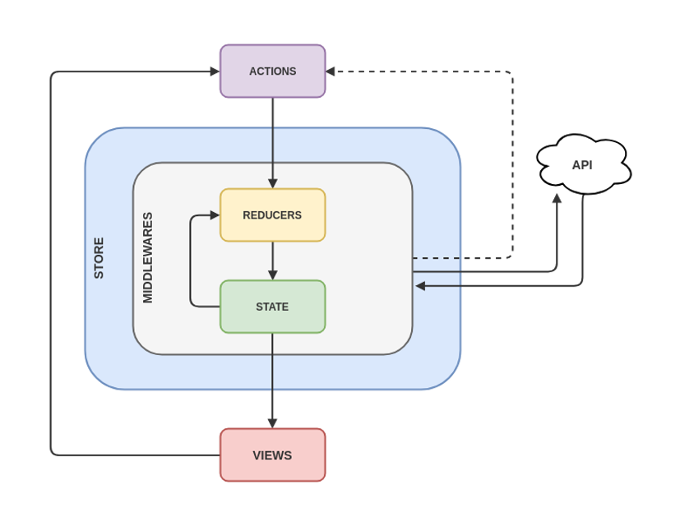
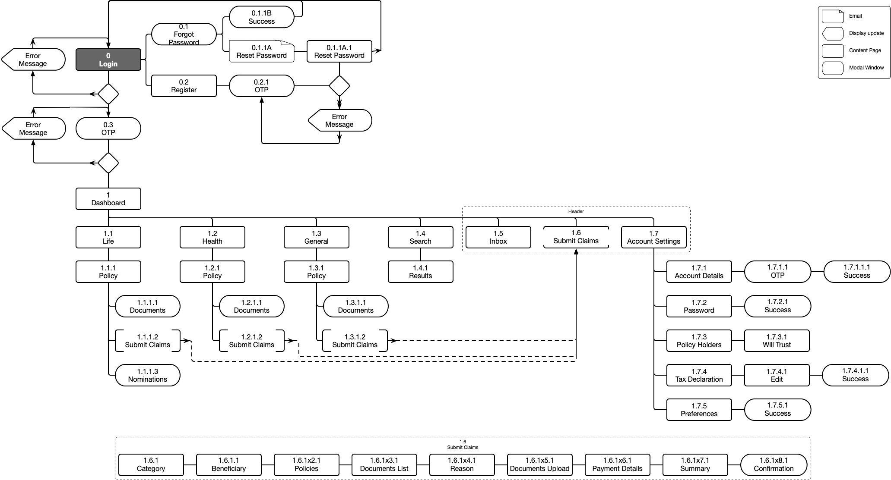

<a id="top"></a>
This readme file is written for developers. Please check [Jira](https://projectirene.atlassian.net/secure/RapidBoard.jspa?rapidView=22&view=planning.nodetail) and [Confluence](https://projectirene.atlassian.net/wiki/spaces/UP/pages/835125303/Unified+Portal+1.0) for any project details.

---

## Index

- [DEV Environment Setup](#dev-environment-setup)
- [Get Started](#get-started)
- [Testing and Build](#testing-and-build)
- [Architecture Design](#architecture-design)
- [Folder Structure, Definitions and Convensions](#folder-structure-definitions-and-convensions)
- [Code and Style Tip and Example](#code-and-style-tip-and-example)
- [Sitemap](#Sitemap)
- [Configs](#configs)
- [Managing Dependencies](#managing-dependencies)
- [API Versioning](#api-versioning)
  <br>
  <br>

---

## DEV Environment Setup

<a href="#top" style="float: right;" >Back to top</a><br>

### 1. Env (important)

- NODE - 10.15.0 (LTS)

checking node version `node --version`

if you installed [nvm](https://github.com/creationix/nvm),

`nvm install --lts` or `nvm install 10.15.0`.

If already installed, `nvm use 10.15.0`

### 2. Linting

Linting will be executed as pre-commit hook and pre-build.

- tslint: airbnb
- prettier: airbnb
- stylelint: airbnb

This project is following [airbnb](https://github.com/airbnb/javascript) rules that most popular.

### 3. vscode settings

#### A. Install recommended extensions

`npm run install:ext`

and reload vscode `press F1 -> reload window`.

If you faced error that 'code command not found',

`press F1 -> Shell Command: install 'code' command in PATH`

then, run above npm script again.

#### B. Setup workspace settings

`.vscode/settings.json`

```json
{
  "editor.formatOnSave": true,
  "javascript.format.enable": false,
  "tslint.autoFixOnSave": true,
  "prettier.tslintIntegration": true
}
```

  <br>
  <br>

---

## Get Started

<a href="#top" style="float: right;" >Back to top</a><br>

Start dev server with local api

```
npm start
npm run start
```

Start dev server with deployed api (sit/uat)

```
npm run start:sit
npm run start:uat
```

Start component dev server (styleguidist, default port: 4040)

```
npm run start:comp
```

---

## Testing and Build

<a href="#top" style="float: right;" >Back to top</a><br>

Testing scripts

```
// running 1 time jest unit testing
npm run test

// watch mode
npm run test:watch

// generating coverage
npm run test:cov

// opening the coverage report
npm run test:open
```

Cache Clear scripts

```
// clear cache, dist, testing reports
npm run clean
```

Build scripts

```
// build with testing
npm run build

// build without testing
npm run build:only

// build with bundle analysis
npm run build:ba

// build component catalogue (styleguidist)
npm run build:comp
```

  <br>
  <br>

---

## Architecture Design

<a href="#top" style="float: right;" >Back to top</a><br>



- Business logic must be in service layer or reducers, not in component.
- Middlewares must handle side-effect.
  - most of the simple operation: use thunk
  - if any complex handling: use saga or observable
- Business-related state will be stored in the redux store
- Presentational state will be handled in component level.
- Any persist state during a session, must be stored in SessionStorage
- Any persist state for long term storing, will be stored in LocalStorage or else.

  <br>
  <br>

---

## Folder Structure, Definitions and Convensions

<a href="#top" style="float: right;" >Back to top</a><br>

### Folder Structure

```
/src
  /assets
  /components
    /_base (base, atomic components)
      /BaseCompA
        /__snapshots__
        BaseCompA.spec.jsx (must have a snapshot testing)
        BaseCompA.jsx (same name as folder)
        index.ts (export all)
      ...
    /ComposedCompA (composition of base component)
      /__snapshots__
      ComposedCompA.spec.tsx (must have a snapshot testing)
      ComposedCompA.tsx (same name as folder)
      index.ts (export all)
  /config
  /modules
    /ExampleModuleA (duck-like redux modules)
      ExampleModuleA.ts (duck-like file must follow the folder name)
      api.ts (api related thunk operation)
      model.ts (typescript types)
      selector.ts (reselect selectors)
      constant.ts
  /pages (redux connected)
    /PageA
      /components (page specific, composed component)
      constant.ts
      operation.ts (thunk, saga - crossing over combined reducers)
      PageA.jsx (same name as folder, may have sub-route setup)
      index.ts
  /store (redux setup)
  /services (global services)
  /styled (style and styled-component related)
  /utils
    /hoc
    ...
  ...
```

- component
  - UI component from atom to template level
- page
  - full layout with several components
  - redux connected
  - consumed by top-level routes layer
  - may have page specific operations that handling part of business logic
- modules
  - feature based redux stuffs
  - business logic
- service
  - function/class that holds configuration and methods as a global handler
  - e.g. interceptor, error ...

Convension

- js/ts files: camelCase
- assets files: hyphen-allowed (kebab-case)
- constants: SNAKE_CASE
- internal file/variables: \_startWithUnderscore.js / `const _interal = 'hello'`
- typescript type interface: `IComponentNameProps`

  <br>
  <br>

---

## Code and Style Tip and Example

### 1. Typescript

This project is using [Typescript](https://www.typescriptlang.org/docs/handbook/typescript-in-5-minutes.html) as a static typing just like [Flow](https://github.com/facebook/flow). But comparing with Flow, Typescript has more advantages with vscode, has very similar syntax and verboseness with Flow. The advantage of Flow is easy to adopt in the middle of any project, but eventually, you will need to touch all files to get a good quality of static typing support.

But we are not using Typescript to force someone to follow OOP style coding, only for replacing [prop-types](https://github.com/facebook/prop-types) to achieve code safety in compile stage, not runtime stage. And this time of experience will be extended to enterprise level Angular or contributing open source project written in Typescript.

Below example means, function `fn` will accept `any` type of argument, will return `any` type of result. The `any` is a wildcard, it will be a good starting point.

```ts
const fn = (arg: any): any => arg.toString();
```

But once you familiar with the [basic type](https://www.typescriptlang.org/docs/handbook/basic-types.html) of typescript, please try not to use `any` as much as possible.

```ts
const fn = (arg: number): string => arg.toString();
```

There are some basic types, `boolean`, `number`, `string`, `void`, `undefined`, `null`, `object`. And if you need a type of array, then `string[]` will be an array with string element.

The `|` operator mean a `or` condition, the `&` is an `and` condition.

```ts
// arg can be a number or string, the function will return string
const fn = (arg: number | string): string => arg.toString();

// args can be an array of number or string type elements, the function will return string.
const fn2 = (...args: (number | string)[]): string =>
  args.reduce((a, c) => a + c.toString(), '');
```

In react, there are more types and it may confused. Please refer this [cheatsheet](https://github.com/sw-yx/react-typescript-cheatsheet) when you need React types.

In general, React component with typescript will look like below.

```tsx
import React, { Component } from 'react';

export interface IExampleProps {
  id?: string;
}

export interface IExampleState {
  isExample?: boolean;
}

class Example extends Component<IExampleProps, IExampleState> {
  render() {
    return <div>hello React example</div>;
  }
}

export default Example;
```

If you want optional types, `?` is the one.

```ts
export interface IExampleProps {
  id?: string;
}
```

But if there are so many props needed to be converted as optional, then `Partial` is the one you need.

```ts
export interface Partial<IExampleProps> {
  id: string;
}

// same as
export interface IExampleProps {
  id?: string;
}
```

And there is [Generics](https://www.typescriptlang.org/docs/handbook/generics.html) that allow pass type argument to create resuable components or functions.

```ts
// generic type P will be assigned to props
const withHoc = <P>(Component: React.ReactNode): any => (props: P): React.ReactNode => <Component {...props} />

interface IHomeProps {
  id?: string;
}

// usage
withHoc<IHomeProps>(Home)
```

### 2. Style

  <br>
  <br>
---

## Sitemap

<a href="#top" style="float: right;" >Back to top</a><br>

Please check [Confluence](https://projectirene.atlassian.net/wiki/spaces/UP/pages/835125303/Unified+Portal+1.0)



  <br>
  <br>

---

## Configs

<a href="#top" style="float: right;" >Back to top</a><br>

### Overal Config

For port, API Url etc, please check `./config/config.js`

```js
const CONFIGS = {
  // webpack-dev-server port
  DEV_SERVER_PORT: 3000,
  API_SERVER_URL_LOCAL: 'http://localhost:8080',
  BASE_DEV: '/',
  BASE_PROD: '/',
  // for production source map
  PROD_SOURCE_MAP: false,
  BROWSER_CACHE_DISABLED: true,
};
```

### Styleguidist

If you want to change the [port](https://github.com/styleguidist/react-styleguidist/blob/master/docs/Configuration.md#serverport) of stylegudist, please update `./config/styleguidist/styleguide.config.js` and `package.json`

### Relative Path Resolve Config

`./tsconfig.json`

```json
{
  "compilerOptions": {
    "paths": {
      "@/*": ["src/*"],
      "@component/*": ["src/component/*"]
      // add more ....
    }
  }
}
```

The path will be resolved to jest `moduleNameMapper` and webpack `resolve.alias`. please check the config file if you want to know current path configs.

Now you can import sth like `import { Button } from '@component/Button';`

  <br>
  <br>

---

## Managing Dependencies

<a href="#top" style="float: right;" >Back to top</a><br>

Once you add a new npm module, please removing carets `^` to lock the version of the module. It will prevent unwanted update via `npm install` that may make a trouble even the update of the module was a minor patch.

If you want to check possible update of modules, try `npm outdated`. And install the specific version of modules via `npm i [-D] moduleName@1.1.1` after checking the release note, not via `npm update`.

  <br>
  <br>

---

## API Versioning

<a href="#top" style="float: right;" >Back to top</a><br>

If CI doesn't provide env variables for the version, please update manually `./config/config.js`.

  <br>
  <br>
